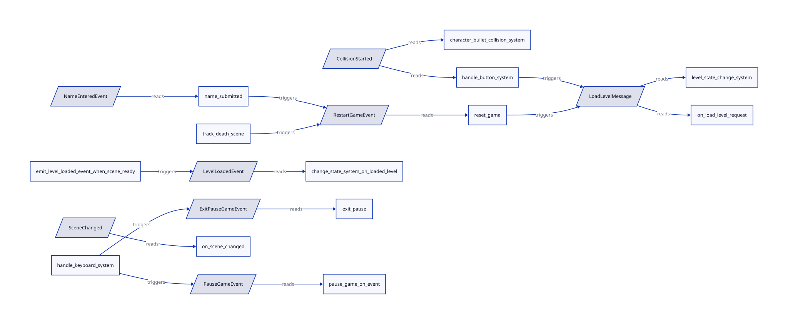
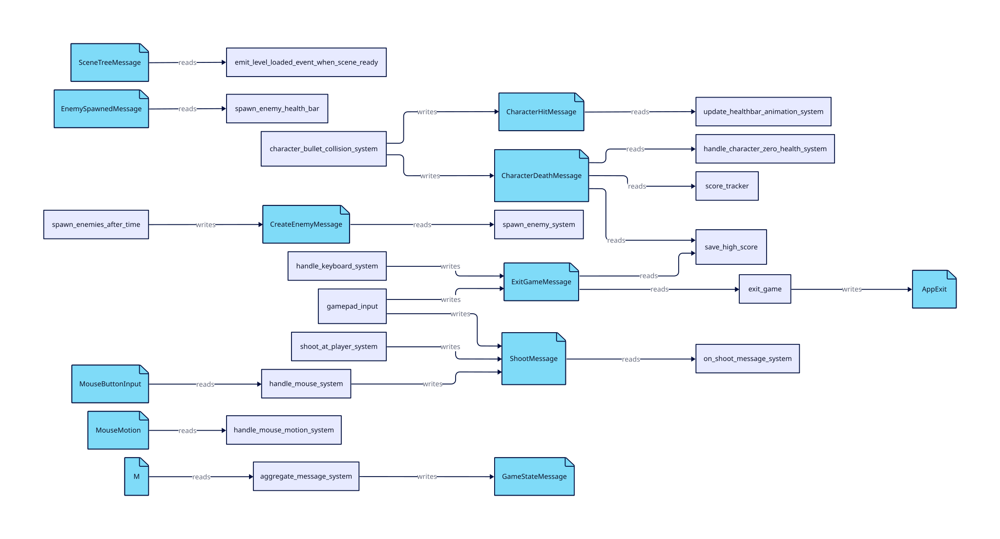
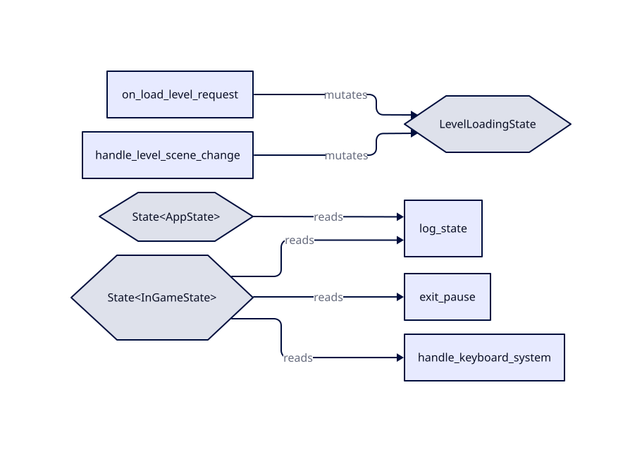

# BulletsOnWheels

## Tools

Nightly rustfmt is used:

```bash
rustup toolchain install nightly
cargo +nightly fmt
```

or make nightly the default for this project only:

```bash
rustup override set nightly
```


## Architecture

<!-- ARCH:events -->
### Events


<!-- /ARCH:events -->

<!-- ARCH:messages -->
### Messages


<!-- /ARCH:messages -->

<!-- ARCH:states -->
### States


<!-- /ARCH:states -->